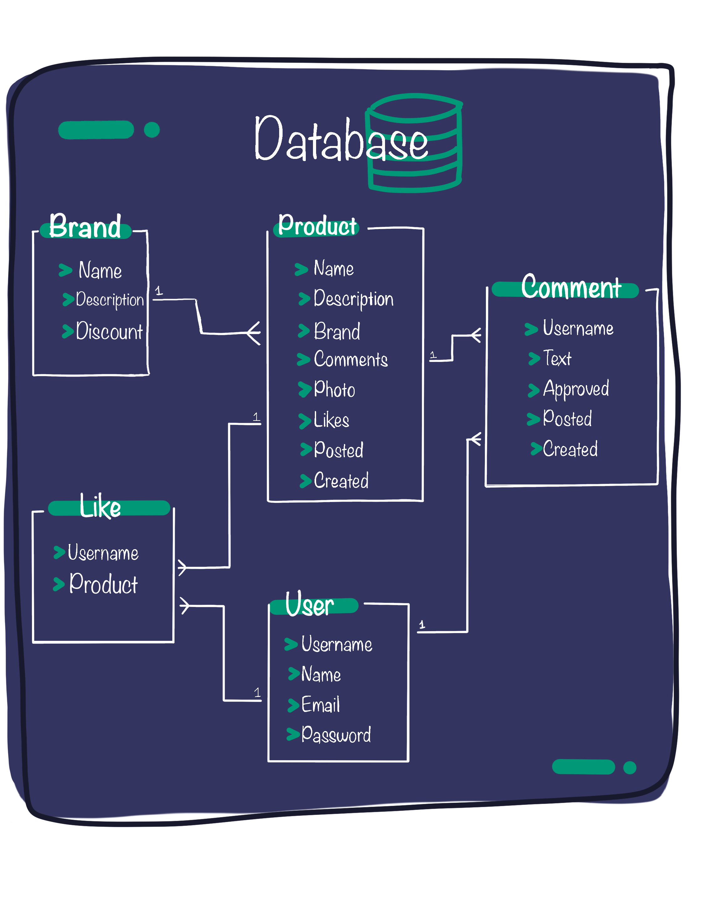

# Ejercicio práctico de Django

## Instalación:

```
python -m venv env

# Activación en Unix
source env/bin/activate

# Activación en Windows
env\Scripts\activate

pip install -r requirements.txt

make migrate
make run
```

Para crear un super usuario y acceder al admin:

```
make createsuperuser
```

## Base de datos:

Esto proyecto requiere que tenga instalado MySQL.
Actualice los datos de la base de datos que quiere utilizar en `settings/locale.py`.

```
DATABASES = {
    'default': {
        'ENGINE': 'django.db.backends.mysql',
        'NAME': 'nombre_base_de_datos',
        'USER': 'user',
        'PASSWORD': 'pass',
        'HOST': 'host',
        'PORT': 'port'
    }
}
```

docs: https://docs.djangoproject.com/en/4.2/ref/settings/#databases

## Diagrama de la base de datos:

